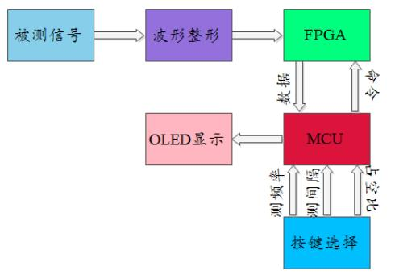
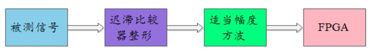
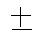

**2026年通信工程系电赛培训**

**基于视觉巡线的自动行驶小车系统设计**

<table><tr><td>
<strong>班    级</strong>
</td><td colspan="3">
202x级通信工程0x班
</td></tr><tr><td>
<strong>姓    名</strong>
</td><td>
XXX
</td><td>
<strong>学    号</strong>
</td><td>
2x03170xxx
</td></tr><tr><td colspan="2">
<strong>演示视频（20）</strong>
</td><td colspan="2"></td></tr><tr><td colspan="2">
<strong>技术报告（40）</strong>
</td><td colspan="2"></td></tr></table>

**2026年5月23日**

**摘    要**

（小四、宋体，300字以内）

关键词：脉宽；脉冲；数显；电容（小四、宋体）

**基于视觉巡线的自动行驶小车系统设计**

# **一、系统方案**

本系统主要由单片机控制模块、XXX模块、XXX模块、电源模块组成，下面分别论证这几个模块的选择。

## **1、主控制器件的论证与选择**

1\.1\.1控制器选用

单片机比较

方案一：采用传统的51系列单片机。

XXXXXX\.

方案二：采用以增强型80C51内核的STC系列单片机

XXXXXX

通过比较，我们选择方案二。

1\.1\.2控制系统方案选择

方案一：采用在面包板上搭建简易单片机系统

在面包板上搭建单片机系统可以方便的对硬件做随时修改，也易于搭建，但是系统连线较多，不仅相互干扰，使电路杂乱无章，而且系统可靠性低，不适合本系统使用。

方案二：自制单片机印刷电路板

自制印刷电路实现较为困难，实现周期长，此外也会花费较多的时间，影响整体设计进程。不宜采用该方案。

方案三：采用单片机最小系统。

单片机最小系统包含了显示、矩阵键盘、A/D、D/A等模块，能明显减少外围电路的设计，降低系统设计的难度，非常适合本系统的设计。

综合以上三种方案，选择方案三。

## **2、XXXX的论证与选择**

方案一：XXX。XXXX

方案二：XXX。XXXX

方案三：XXX。XXXX

综合以上三种方案，选择方案三。

## **3、控制系统的论证与选择**

方案一：XXX。XXXX

方案二：XXX。XXXX

综合考虑采用XXXXX。

# **二、系统理论分析与计算**

## **1、XXXX的分析**    

### **（1）XXX**

XXXX

### **（2）XXX**

XXXX

### **（3）XXX**

XXXX

## **2、XXXX的计算**  

### **（1）XXX**

XXXX

### **（2）XXX**

XXXX

### **（3）XXX**

XXXX

## **3、XXXX的计算**   

### **（1）XXX**

XXXX

### **（2）XXX**

XXXX

### **（3）XXX**

XXXX

# **三、电路与程序设计**

## **1、电路的设计**

### **（1）系统总体框图**

系统总体框图如图X所示，XXXXXX

图X   系统总体框图

### **（2）XXXX子系统框图与电路原理图**

1、XXXX子系统框图

图X   XXXX子系统框图

2、XXXXX子系统电路

图X   XXXX子系统电路

### **（3）XXXX子系统框图与电路原理图**

1、XXXX子系统框图

图X   XXXX子系统框图

2、XXXXX子系统电路

图X   XXXX子系统电路

### **（4）电源**

电源由变压部分、滤波部分、稳压部分组成。为整个系统提供5V或者12V电压，确保电路的正常稳定工作。这部分电路比较简单，都采用三端稳压管实现，故不作详述。

## **2、程序的设计**

### **（1）程序功能描述与设计思路**

1、程序功能描述

根据题目要求软件部分主要实现键盘的设置和显示。

1）键盘实现功能：设置频率值、频段、电压值以及设置输出信号类型。

2）显示部分：显示电压值、频段、步进值、信号类型、频率。

2、程序设计思路

### **（2）程序流程图**

1、主程序流程图

2、XXX子程序流程图

3、XXX子程序流程图

4、XXX子程序流程图

# **四、测试方案与测试结果**

## **1、测试方案**

（1）硬件测试

（2）软件仿真测试

（3）硬件软件联调

## **2、测试条件与仪器**

测试条件：检查多次，仿真电路和硬件电路必须与系统原理图完全相同，并且检查无误，硬件电路保证无虚焊。

测试仪器：高精度的数字毫伏表，模拟示波器，数字示波器，数字万用表，指针式万用表。

## **3、测试结果及分析**

### **（1）测试结果\(数据\)**

2V档信号测试结果好下表所示：                               （单位/V）

<table><tr><td>
信号值
</td><td>
0.2050
</td><td>
0.2100
</td><td>
0.2045
</td><td>
0.4026
</td><td>
1.007
</td><td>
1.542
</td><td>
1.669
</td><td>
1.999
</td></tr><tr><td>
显示
</td><td>
0.2051
</td><td>
0.2100
</td><td>
0.2044
</td><td>
0.4026
</td><td>
1.006
</td><td>
1.542
</td><td>
1.669
</td><td>
1.999
</td></tr></table>

### **（2）测试分析与结论**

根据上述测试数据，XXXXXXXXXXXXXXXXXXXXXXXXXXXXX，由此可以得出以下结论：

1、

2、

3、

综上所述，本设计达到设计要求。

# **五、参考文献**

\[1\] 谭浩强\.C语言程序设计\[M\]\.北京:清华大学出版社,2012

# **附录1：电路原理图**

# **附录2：作品实物图**